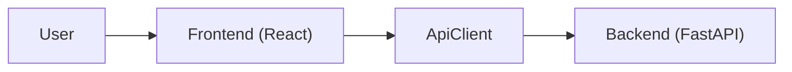

**Разработка системы мониторинга и аналитики судебных дел для  юридического подразделения ПАО Сбербанк**

Пилотно - "Планировщик"

Данное web приложение предназначено для автоматизации мониторинга и контроля судебных дел в юридическом подразделении. Система предоставляет аналитику, визуализацию ключевых показателей, контроль сроков и формирует персональные задачи для сотрудников.

Бэкенд реализован на Python (FastAPI), фронтенд — на TypeScript (React).

---

**Лицензия**  
Проект распространяется под лицензией MIT. Подробнее см. в файле LICENSE.

---

## Запуск приложения

### 1. Первичная установка зависимостей и запуск

**Бэкенд**:

```bash
cd backend
pip install -r requirements.txt
python app/main.py
```

**Фронтенд**:

```bash
cd frontend
npm install
npm run dev
```

---

### 2. Запуск с помощью скрипта

**Windows**:

```bash
run_project.bat
```

**Linux**:

```bash
./run_project.sh
```

---

## Настройка тестовых данных

Тестовые файлы должны находиться в папке:
`backend/app/data/dev_data/`

Необходимые файлы:
- `detailed.xlsx` - детальный отчет по судебной работе
- `documents.xlsx` - отчет по полученным и переданным документам

---
**ProjectConverter.py** - утилита для конвертации файлов проекта в текстовый формат и обратно. Сохраняет структуру папок и расширения файлов, добавляя их в названия. Используется для безопасного переноса проектов между системами. Запуск: `python ProjectConverter.py` с выбором режима через консоль.

## Архитектура приложения


